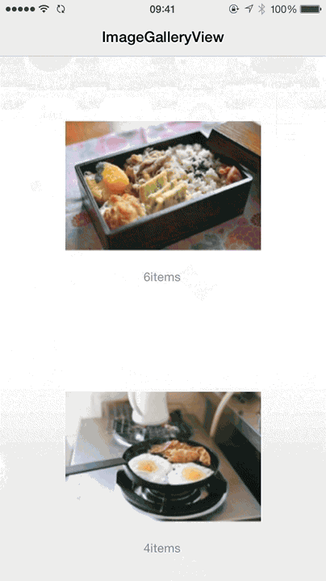

ImageGalleryView
================

## Preview



## Usage

### Installation

copy `ImageGalleryView.h`, `ImageGalleryView.m` into your project.


Add the following import to the top of the file:

```objc
#import "ImageGalleryView.h"
```

### Configuration

```objc
ImageTapView *tmpView = (ImageTapView *)[self.view viewWithTag: 20 + i];
CGRect convertRect = [[tmpView superview] convertRect:tmpView.frame toView:self.view];
ImageGalleryView *scrollView = [[ImageGalleryView alloc] initWithFrame:(CGRect){i * self.innerScrollView.bounds.size.width, 0, self.innerScrollView.bounds.size}];
[scrollView setContentWithFrame:convertRect];
[scrollView setImage:tmpView.image];
[self.innerScrollView addSubview: scrollView];
scrollView.delegate = self;
[scrollView setAnimationRect];
```

## License

The MIT License (MIT)

Copyright (c) 2015 xdf
